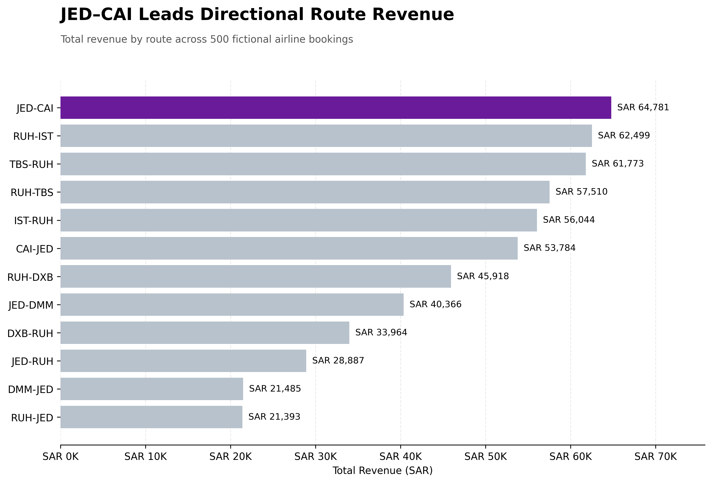
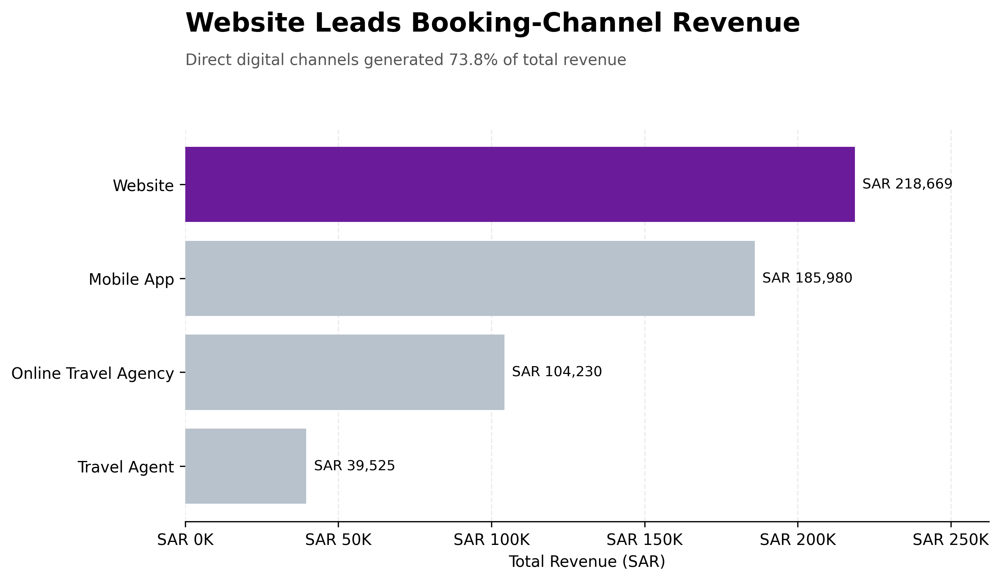
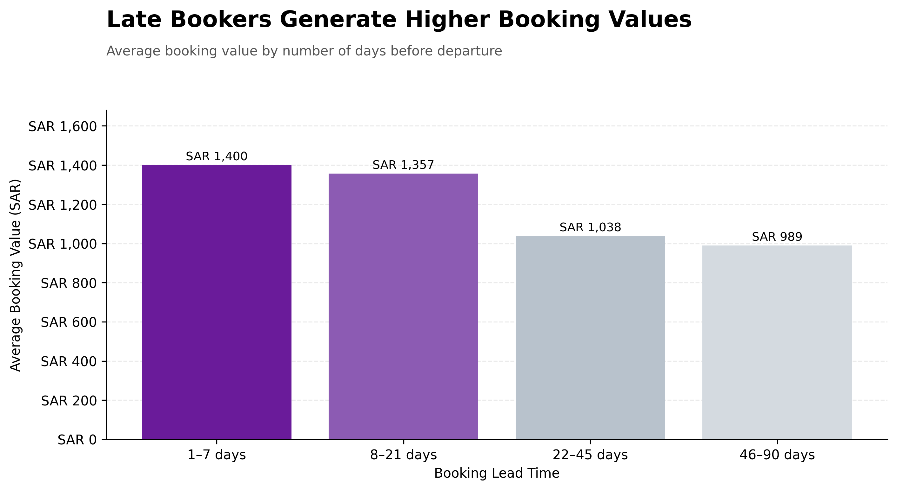
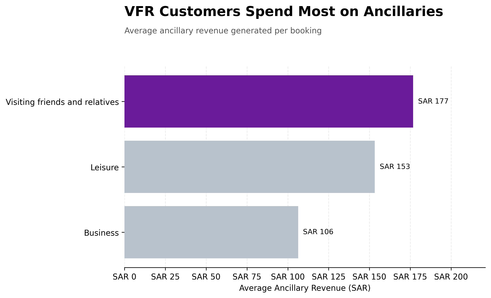
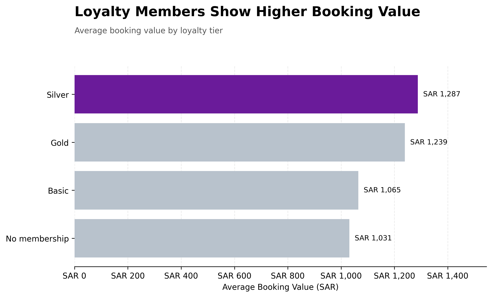
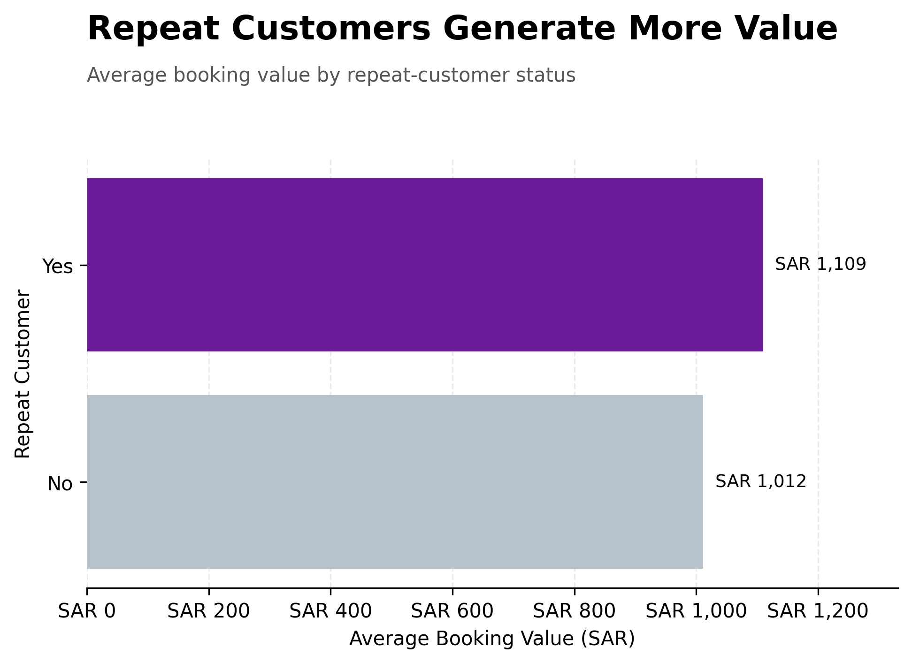

# Airline Customer Analytics

An exploratory business analytics project examining 500 fictional airline bookings across customer behaviour, route performance, booking channels, ancillary revenue and loyalty.

I created this project as part of my MSc Computer Science (Business Computing) portfolio to practise turning raw commercial data into clear findings and practical recommendations.

> This project uses fictional data created solely for learning and portfolio purposes.

## Project Overview

The fictional airline collects customer and booking data but needs a clearer understanding of:

* Which routes generate the most bookings and revenue
* How direct and indirect booking channels perform
* Whether booking lead time affects customer value
* Which customer segments purchase the most ancillary services
* How loyalty membership and repeat behaviour relate to booking value

## Headline Results

| Metric                     |      Result |
| -------------------------- | ----------: |
| Total bookings             |         500 |
| Unique customers           |         249 |
| Total revenue              | SAR 548,404 |
| Average booking value      |   SAR 1,097 |
| Ancillary revenue          |  SAR 75,858 |
| Ancillary share of revenue |       13.8% |

## Key Findings

### Route Performance

* JED–CAI generated the highest total revenue at SAR 64,781.
* RUH–IST recorded the highest average booking value at approximately SAR 1,603.
* JED–DMM generated the most bookings but ranked eighth for revenue, showing that booking volume alone does not determine route value.

### Booking Channels

* Website was the largest channel, generating 202 bookings and SAR 218,669.
* Website and Mobile App combined contributed 75.2% of bookings and 73.8% of revenue.
* Online Travel Agencies generated the highest average booking value at approximately SAR 1,184.

### Booking Lead Time

Customers booking within seven days of departure generated the highest average booking value at approximately SAR 1,400, compared with SAR 989 among customers booking 46–90 days in advance.

### Ancillary Revenue

Customers visiting friends and relatives generated the highest average ancillary revenue at approximately SAR 177 per booking, followed by leisure customers at SAR 153.

### Loyalty and Repeat Behaviour

* Silver members generated the highest average booking value at approximately SAR 1,287.
* Customers without a loyalty membership generated the lowest average booking value at approximately SAR 1,031.
* Repeat customers generated higher average booking and ancillary values than non-repeat customers.
* These findings show associations within the fictional dataset and should not be interpreted as proof of causation.

## Commercial Recommendations

1. Evaluate routes using booking value and revenue alongside passenger volume.
2. Continue improving direct-channel conversion, personalisation and app adoption.
3. Promote relevant baggage and seat bundles to leisure and visiting-friends-and-relatives segments.
4. Target late bookers with flexibility, priority and convenience-based services.
5. Test loyalty-enrolment prompts and personalised offers across the booking journey.

## Tools Used

* Python
* Pandas
* Matplotlib
* Google Colab
* Microsoft Excel
* GitHub

## Project Files

* [View the complete analysis notebook](airline_customer_analysis_clean.ipynb)
* [Download the original fictional dataset](fictional_airline_bookings.xlsx)
* [View the cleaned dataset](cleaned_airline_bookings.csv)

## Limitations

* The dataset is fictional and contains only 500 bookings.
* Operational measures such as capacity, load factor, frequency and route costs are not included.
* The analysis identifies relationships but does not establish causation.
* A larger historical dataset would be required before making real commercial decisions.
